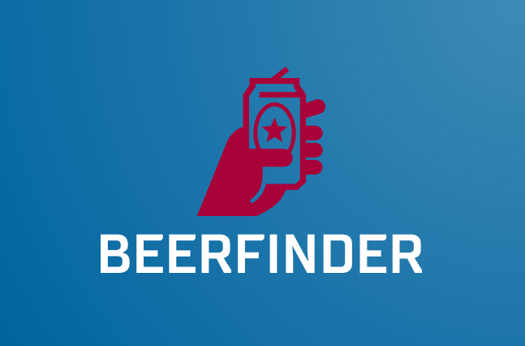

# Beerfinder API
A simple Geolocation Beers API finder for PHPConference 2023 Training by Leonardo Tumadjian

# Roteiro
1. Apresentação do Projeto
2. Setup do projeto
3. Conhecendo o PHPStan
4. Conhecendo o Infection
5. TDD com Domain (Beer price cannot be zero)
6. TDD com UseCases
7. Resolvendo I/O JSON com Presenter
8. Adicionando Slim e Container de DI
9. Adicionando MongoDB em busca de Locations (Extra)

# How to start?
```bash
$ docker compose up -d

# get in the container
$ shell/exec bash

$ composer install
```

# Composer commands obs: run inside container
```bash
# Fix de PSR-1/12
$ composer fix

# Verifica analise estática PHPStan
$ composer stan

# Rodar os testes
$ composer test

# Gerar o Coverage
$ composer cover

# Gerar o cover do Infection
$ composer infection
```
